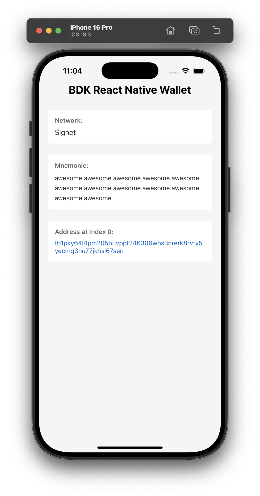

# Running the iOS Example App

1. Get into the [example](https://github.com/bitcoindevkit/bdk-rn/tree/master/example) directory.
2. Download a pre-built tarball from our [GitHub Releases](https://github.com/bitcoindevkit/bdk-rn/releases) and put it at the root of the repository.
3. Follow along the next sections to build the iOS app and launch it locally.

<div>
  
</div>

**Prerequisite:** CocoaPods >= `1.13` (`brew install cocoapods` should do it). 

```shell
cd example/
# Don't forget to add the tarball at the root of the repo
# https://github.com/bitcoindevkit/bdk-rn/releases
npm install
cd ios/
pod install
npm run ios
```
